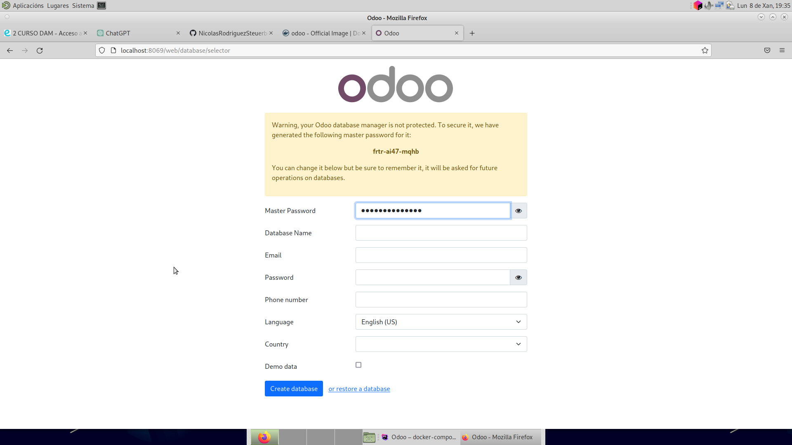

# Odoo

## En este proyecto estaremos trabajando con Odoo

### 1. ¿Qué es Odoo?

Odoo es una plataforma de software empresarial de código abierto que 
proporciona una suite integrada de aplicaciones empresariales, abarcando áreas
como contabilidad, inventario, ventas, compras, recursos humanos y más. 
Permite a las empresas gestionar y automatizar diversos procesos, centralizando 
la información en una única plataforma. Además, Odoo es altamente personalizable 
y extensible, lo que significa que las 
empresas pueden adaptar sus funciones según sus necesidades específicas.

### ¿Qué es lo que hemos hecho hasta el momento?
+ Pues bien, hasta ahora lo que hemos hecho ha sido crear un programa en java, que crea
una base de datos llamada `odoo`. Con este otro programa llamado `Odoo`, lo hemos vinculado con la base 
de datos que creamos y hemos levantado un servicio **Odoo**.
+ Ahora nos falta configurar este servicio a nuestro gusto

### Seguiremos trabajando en este proyecto