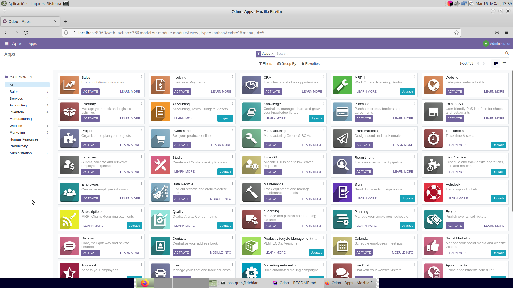
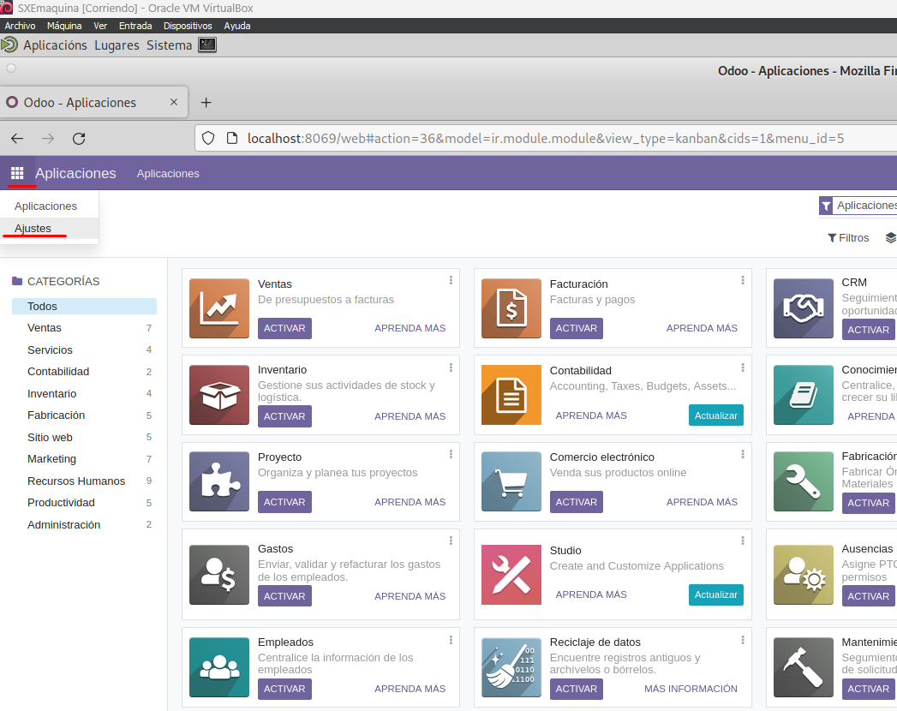
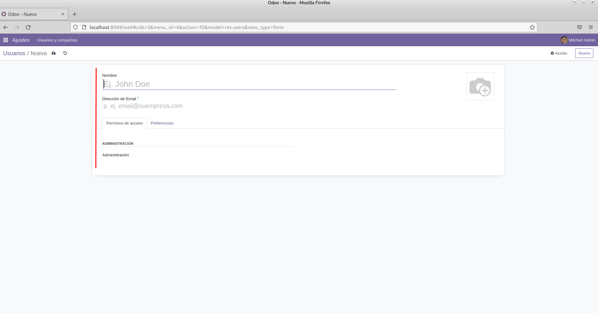
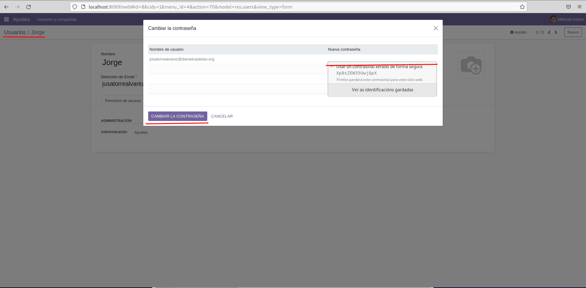

# Odoo

## En este proyecto estaremos trabajando con Odoo

### 1. ¿Qué es Odoo?

Odoo es una plataforma de software empresarial de código abierto que 
proporciona una suite integrada de aplicaciones empresariales, abarcando áreas
como contabilidad, inventario, ventas, compras, recursos humanos y más. 
Permite a las empresas gestionar y automatizar diversos procesos, centralizando 
la información en una única plataforma. Además, Odoo es altamente personalizable 
y extensible, lo que significa que las 
empresas pueden adaptar sus funciones según sus necesidades específicas.

### ¿Qué es lo que hemos hecho hasta el momento?
+ Pues bien, hasta ahora lo que hemos hecho ha sido crear un programa en java, que crea
una base de datos llamada `odoo`. Con este otro programa llamado `Odoo`, lo hemos vinculado con la base 
de datos que creamos y hemos levantado un servicio **Odoo**.
+ Ahora nos falta configurar este servicio a nuestro gusto

### Seguiremos trabajando en este proyecto
        
        Efectivamente segumimos trabajando en la tarea.

### Este es el preview de Odoo

## Aquí empezamos la parte 2 de este proyecto 22/01/24

### 1. Cómo crear usarios y ponérles contraseña:

* Accederemos a la cuadrado de arriba a la izquierda presionando en el
y seleccionaremos ajustes.

* Una vez dentro de este menú, tendrémos que hacer click en *Nuevo* y nos aparecerá el siguiente menú
dónde configurarémos al usuario.

* Cuando acabemos de configurar al usuario le añadirémos una contraseña, de la siguient manera:
  * Haciendo click en el lado derecho de la pantalla donde pone *Acción*.
    Nos saldrá el siguiente menú para configurarle al constraseña.

    En este caso le estaríamos cambiado la contraseña al usuario: Jorge

#### Una vez explicado como crear usuarios y como cambiarles la contraseña vamos a ver como crear un proyecto.
   

